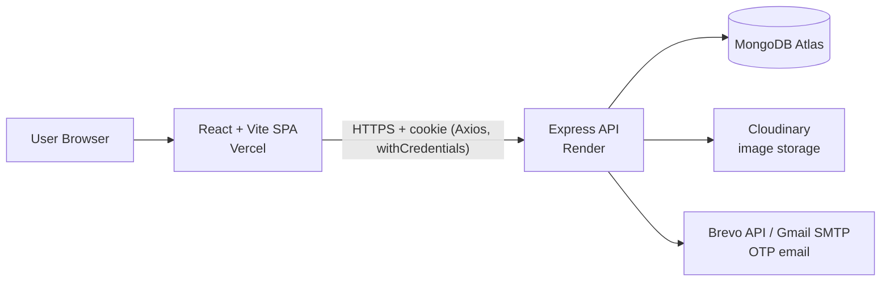
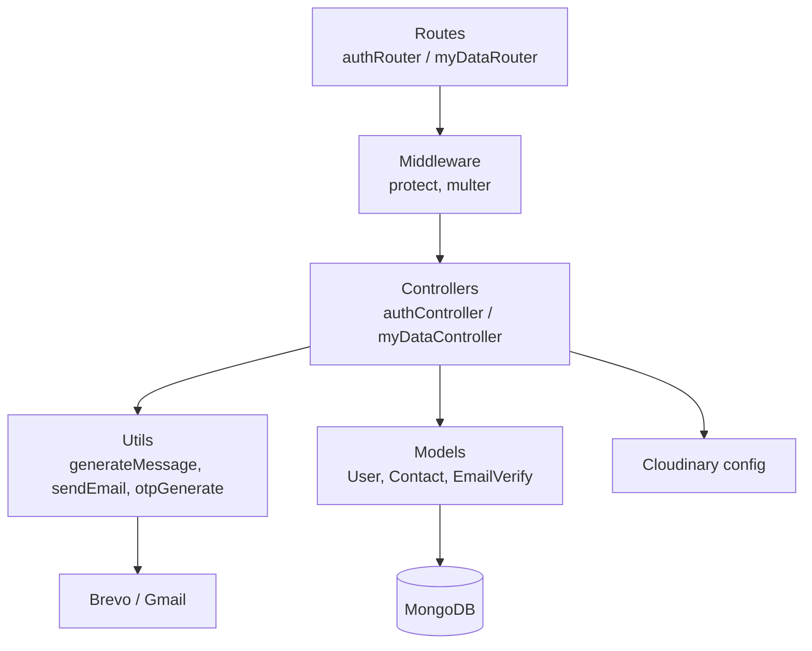
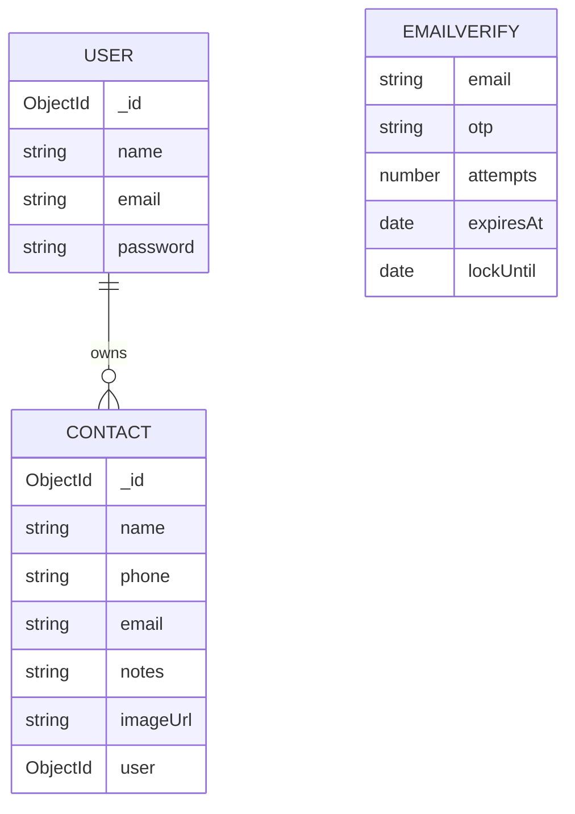
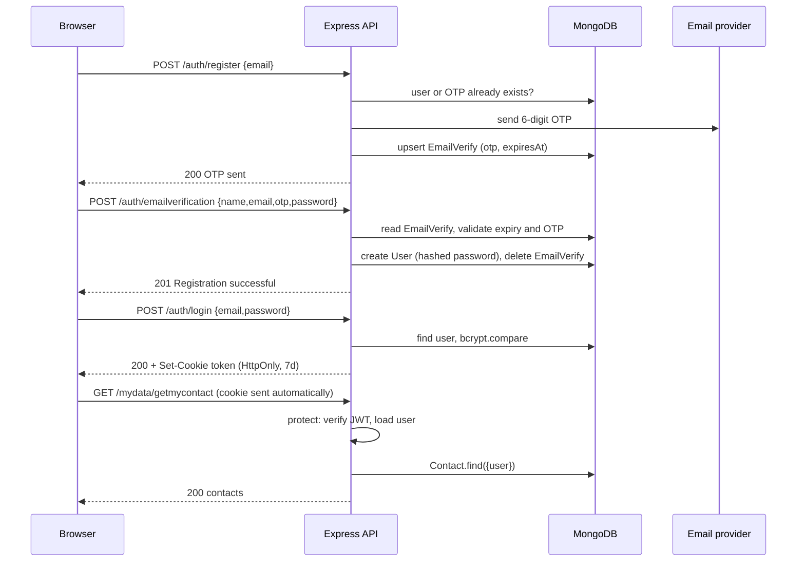
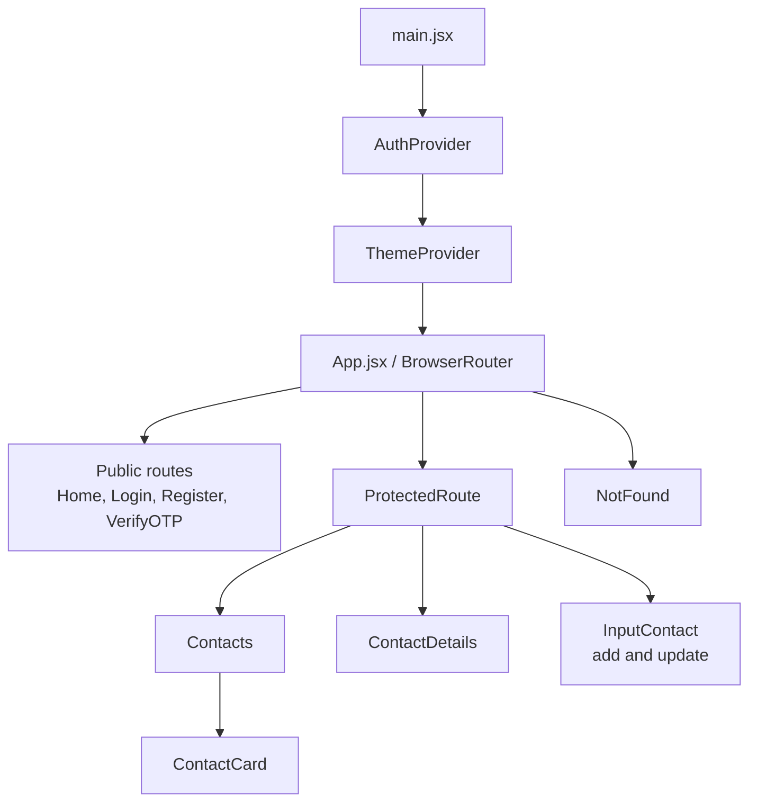

# NexContact: Project Documentation

## 1. About the Project

**NexContact** is a full-stack contact management application (MERN stack). It lets a person create a verified account and keep a private, searchable address book with photos and notes.

**Problem it solves:** keeping contacts organised, accessible from any browser, and private to each user.

**Key capabilities**

- Registration with email OTP verification
- Cookie-based JWT authentication
- Add / view / edit / delete / search contacts
- Profile images stored on Cloudinary
- Light and dark themes

**Deployment:** React app on Vercel, Express API on Render, MongoDB Atlas, Cloudinary for images, Brevo for transactional email.

---

## 2. High-Level Architecture

The frontend is a single-page app that talks to a stateless REST API. Authentication state lives in an HTTP-only cookie holding a JWT, so the browser sends it automatically and JavaScript cannot read it.

---

## 3. Backend Architecture

### 3.1 Stack

Node.js, Express 5, Mongoose 9 (MongoDB), jsonwebtoken, bcrypt, cookie-parser, cors, Multer, Cloudinary SDK, Nodemailer.

### 3.2 Layered structure

| Layer | Files | Responsibility |
|-------|-------|----------------|
| Entry | `server.js` | Loads env, sets CORS (credentials on, single allowed origin), JSON + cookie parsing, mounts routers, connects DB and then starts listening |
| Config | `config/db.js`, `config/coudinary.js` | MongoDB connection (10s server selection timeout, exits on failure); Cloudinary credentials |
| Routes | `routes/authRouter.js`, `routes/myDataRouter.js` | URL to controller mapping; attaches middleware |
| Middleware | `authMiddleware.js` (`protect`) | Reads the `token` cookie, verifies JWT, loads the user (without password) into `req.user`, otherwise responds 401 |
| Controllers | `authController.js`, `myDataController.js` | Business logic |
| Models | `User.js`, `Contact.js`, `Email.js` | Mongoose schemas |
| Utils | `generateMessage.js`, `otpGenerate.js`, `sendEmail.js` | OTP creation, email template, email provider abstraction |

### 3.3 Data models

**User**

| Field | Type | Notes |
|-------|------|-------|
| name | String | required |
| email | String | required, unique |
| password | String | required, bcrypt hash |

**Contact**

| Field | Type | Notes |
|-------|------|-------|
| name | String | required, trimmed |
| phone | String | required, trimmed |
| email | String | lowercase, trimmed |
| notes | String | trimmed |
| imageUrl | String | Cloudinary secure URL, default `null` |
| user | ObjectId (ref User) | required, indexed; owner of the contact |
| createdAt / updatedAt | Date | automatic timestamps |

**EmailVerify** (temporary OTP records)

| Field | Type | Notes |
|-------|------|-------|
| email | String | required |
| otp | String | 6-digit code |
| attempts | Number | resend counter |
| expiresAt | Date | OTP expiry (2 minutes) |
| lockUntil | Date | resend lock window (3 hours) |

`EmailVerify` is standalone: it is keyed by email and only exists between "OTP sent" and "account created".

### 3.4 API reference

**Auth: `/api/auth`** (public)

| Method | Route | Body | Behaviour |
|--------|-------|------|-----------|
| POST | `/register` | `email` | Rejects if the user exists or an OTP record already exists; otherwise emails a 6-digit OTP and stores it |
| POST | `/emailverification` | `name, email, otp, password` | Checks OTP exists, is not expired and matches; hashes the password (bcrypt, 10 rounds), creates the user, deletes the OTP record |
| POST | `/resendotp` | `email` | Blocked while the current OTP is still valid or during the lock; otherwise sends a fresh OTP |
| POST | `/login` | `email, password` | On success sets the `token` cookie (HTTP-only, 7 days) and returns `{_id, name, email}` |
| POST | `/logout` | none | Clears the cookie using the same options it was set with |

**Contacts: `/api/mydata`** (all require `protect`)

| Method | Route | Notes |
|--------|-------|-------|
| GET | `/getmycontact` | Returns `{ allContact: [...] }` for `req.user` |
| POST | `/addcontact` | `multipart/form-data`; Multer `image` field |
| PUT | `/updatemycontact/:id` | Finds by `_id` **and** `user`, so other users' contacts cannot be touched |
| DELETE | `/deletemycontact/:id` | Same ownership check |
| GET | `/searchcontact?search=` | Case-insensitive name match; search text is regex-escaped |

### 3.5 Authentication flow

### 3.6 Image upload flow

1. Browser sends `multipart/form-data` with an `image` file.
2. `protect` runs first, so unauthenticated users cannot upload.
3. Multer stores the file temporarily in `uploads/` (max 5 MB, `image/*` only).
4. Controller uploads it to Cloudinary, keeps the `secure_url`, and always deletes the temp file (`finally`).
5. The URL is saved on the contact as `imageUrl`.

### 3.7 Email delivery

`sendEmail.js` picks a provider at runtime: **Brevo HTTPS API** if `BREVO_API_KEY` is set (needed on Render, which blocks SMTP), otherwise **Gmail SMTP** through Nodemailer. The email is sent *before* the OTP is saved, so a failed send never leaves a stuck OTP record.

### 3.8 Security measures in place

- Passwords hashed with bcrypt
- JWT in an HTTP-only cookie; `secure` and `sameSite: none` in production
- CORS restricted to one origin with credentials
- Per-user data isolation on every contact query
- Regex escaping on search input
- OTPs generated with `crypto.randomInt`
- Upload size and MIME-type limits
- Resend throttling / lockout

---

## 4. Frontend Architecture

### 4.1 Stack

React 19, Vite, React Router v7, React Hook Form, Axios, React Icons, plain CSS (one stylesheet per page/component, theme via CSS variables).

### 4.2 Component and provider tree

### 4.3 Routing

| Path | Component | Access |
|------|-----------|--------|
| `/` | Home | Public |
| `/login` | Login | Public |
| `/register` | Register | Public |
| `/verify-otp` | VerifyOTP | Public |
| `/contacts` | Contacts | Protected |
| `/view` | ContactDetails | Protected |
| `/add-contact` | InputContact | Protected |
| `/update/:id` | InputContact | Protected |
| `*` | NotFound | Public |

`ProtectedRoute` checks `user` from `AuthContext` and redirects to `/login` if it is empty.

### 4.4 State management

| Concern | Mechanism |
|---------|-----------|
| Logged-in user | `AuthContext` (`user`, `login`, `logout`), held in memory |
| Theme | `ThemeContext` (`darkMode`, `changeTheme`); toggles a `dark` class on `<body>` |
| Contacts list, search text, loading | Local `useState` in `Contacts.jsx` |
| Forms | React Hook Form (validation and submit state) |
| Passing a contact between pages | React Router `location.state` (`/view`, `/update/:id`) |
| Email between register and OTP pages | `localStorage` key `email` |

No Redux or other global store is used; the app is small enough for context plus local state.

### 4.5 Pages and components

| File | Purpose |
|------|---------|
| `Home.jsx` | Landing page with theme toggle and "Get Started" |
| `Register.jsx` | Collects email, calls `/auth/register`, then goes to OTP page |
| `VerifyOTP.jsx` | Name, email, OTP, password; creates the account; "Regenerate OTP" button |
| `Login.jsx` | Calls `/auth/login`, stores user in `AuthContext`, redirects to `/contacts` |
| `Contacts.jsx` | Loads contacts, search, add, theme toggle, logout, renders a grid of cards |
| `ContactCard.jsx` | One contact with View / Edit / Delete actions (delete asks for confirmation) |
| `ContactDetails.jsx` | Full read-only view including created and updated times |
| `InputContact.jsx` | Shared add/edit form with image preview, type and size checks, sends `FormData` |
| `ProtectedRoute.jsx` | Auth guard |
| `api/axios.js` | Shared Axios instance with `baseURL` and `withCredentials: true` |

### 4.6 Frontend-backend communication

All calls go through the single Axios instance, which attaches the auth cookie to every request.

| UI action | Request |
|-----------|---------|
| Register | `POST /auth/register` |
| Verify OTP | `POST /auth/emailverification` |
| Resend OTP | `POST /auth/resendotp` |
| Login | `POST /auth/login` |
| Logout | `POST /auth/logout` |
| Load contacts | `GET /mydata/getmycontact` |
| Search | `GET /mydata/searchcontact?search=` |
| Add | `POST /mydata/addcontact` (FormData) |
| Update | `PUT /mydata/updatemycontact/:id` (FormData) |
| Delete | `DELETE /mydata/deletemycontact/:id` |

---

## 5. Typical User Journey

1. Visit the landing page and click **Get Started**.
2. **Register** with an email; an OTP arrives by email.
3. On **Verify OTP**, enter name, OTP and password to create the account.
4. **Log in**; the server sets the auth cookie.
5. On **Contacts**, add, search, view, edit or delete contacts.
6. **Logout** clears the cookie.

---

## 6. Deployment and Configuration

| Part | Host | Notes |
|------|------|-------|
| Frontend | Vercel | Built with `vite build` |
| Backend | Render | `NODE_ENV=production`, `trust proxy` enabled for secure cookies |
| Database | MongoDB Atlas | via `MONGO_URI` |
| Images | Cloudinary | via `CLOUDINARY_*` |
| Email | Brevo (prod) / Gmail (local) | via `BREVO_API_KEY` + `EMAIL_FROM` or `GMAIL_USER` + `GMAIL_PASS` |

Other required variables: `JWT_SECRET`, `PORT`.

---

## 7. Observations and Suggested Improvements

These came up while reading the code. None stop the app working, but they are worth knowing about.

1. **Login is lost on page refresh.** `AuthContext` keeps the user only in memory and there is no "who am I" endpoint, so a refresh sends the user back to login even though the cookie is still valid. Adding a `GET /auth/me` call on app start would fix this.
2. **Logout does not clear `AuthContext`.** `Contacts.jsx` calls the logout API and navigates home but never calls `logout()` from the context, so the in-memory user stays set until refresh.
3. **Hardcoded URLs.** The Render API URL (`axios.js`) and the allowed CORS origin (`server.js`) are hardcoded. Moving them to `VITE_API_URL` and an environment variable would simplify local development.
4. **OTP records never expire on their own.** `EmailVerify` has no TTL index. If a user abandons registration, the record stays and `/register` keeps replying that an OTP already exists until they use "Regenerate OTP". A TTL index on `expiresAt` (or cleanup logic) would help.
5. **Resend logic is hard to follow.** The attempts and lock counters interact in a way that likely does not enforce the intended "3 resends, then 3-hour lock" precisely; worth testing that path.
6. **No rate limiting** on login or register endpoints (for example `express-rate-limit`), and OTP verification has no wrong-guess limit.
7. **Search UI text vs. behaviour.** The UI says it searches by name or email, but the backend only matches on name. The search query is also not URL-encoded on the frontend (`encodeURIComponent` would be safer).
8. **Contact email is required in the form but optional in the schema.** Also `phone` has no format validation on either side.
9. **Unused dependency:** `resend` is listed in the backend `package.json` but not used.
10. **File naming typo:** `config/coudinary.js` (should be `cloudinary.js`).
11. **`ThemeContext` is bypassed on the Contacts page,** which toggles the `dark` class directly, so the two theme controls can get out of sync.
12. **Code style:** mixed indentation in the backend, and the `uploads/` temp folder must exist and be writable on the server.
